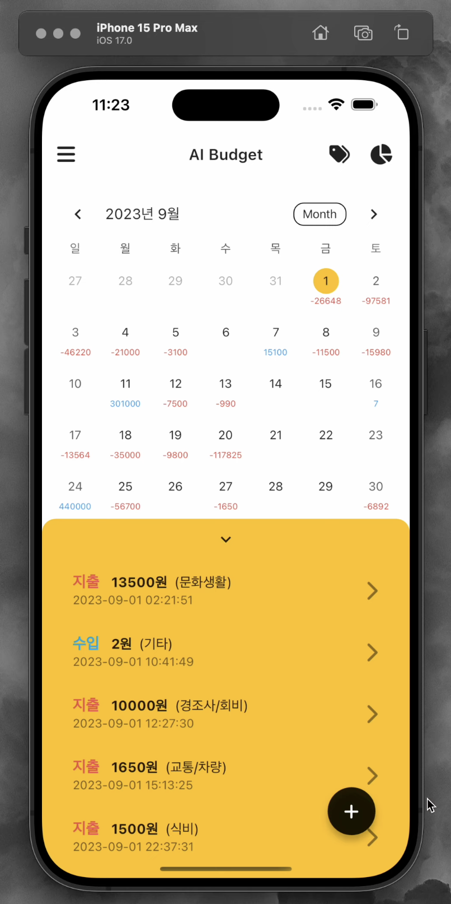
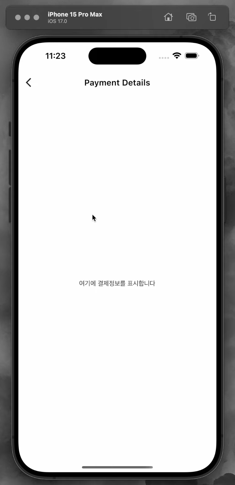

# AI Butget App

## 프로젝트 소개

'AI Budget'은 '싱커톤 시즌 3' 대회 기간 동안 개발된 앱으로, 사용자의 재정 관리를 돕기 위해 설계되었습니다. 
이 앱은 이미지 생성 모델과 언어모델을 활용하여, 전월대비 지출증감을 카테고리 별로 네 컷의 만화로 표현하고, 직관적인 사용자 인터페이스와 함께, 재정 상황을 한눈에 볼 수 있는 캘린더 뷰, 지출 및 수입 추적 기능을 제공하기 위해 기획되었습니다.

## 현재 상태

현재 이 앱은 대회 기간 동안만 제공되던 백엔드 서비스와 API의 지원이 중단되어, 실제 데이터 값을 불러올 수 없는 상태로 예시 데이터가 표시되지 않고 있습니다.

## 기능 소개

- **메인 화면**: 모든 재정 활동을 캘린더 형식으로 표시하여 달력에서 직접 날짜를 선택하여 상세 내역을 볼 수 있습니다.
- **리포트 화면**: 특정 기간 동안의 수입과 지출을 요약한 리포트를 제공합니다. 사용자는 이를 통해 자신의 재정 상태를 더 자세히 이해할 수 있습니다.

## 향후 계획
앱의 백엔드 서비스와 API를 재구성하여, 실제 데이터를 처리하고 사용자에게 제공하는 기능을 구현할 계획입니다. 또한, 사용자 피드백을 바탕으로 UI/UX를 개선하고 추가 기능을 도입하여, 앱을 완성할 계획입니다.

  
  

